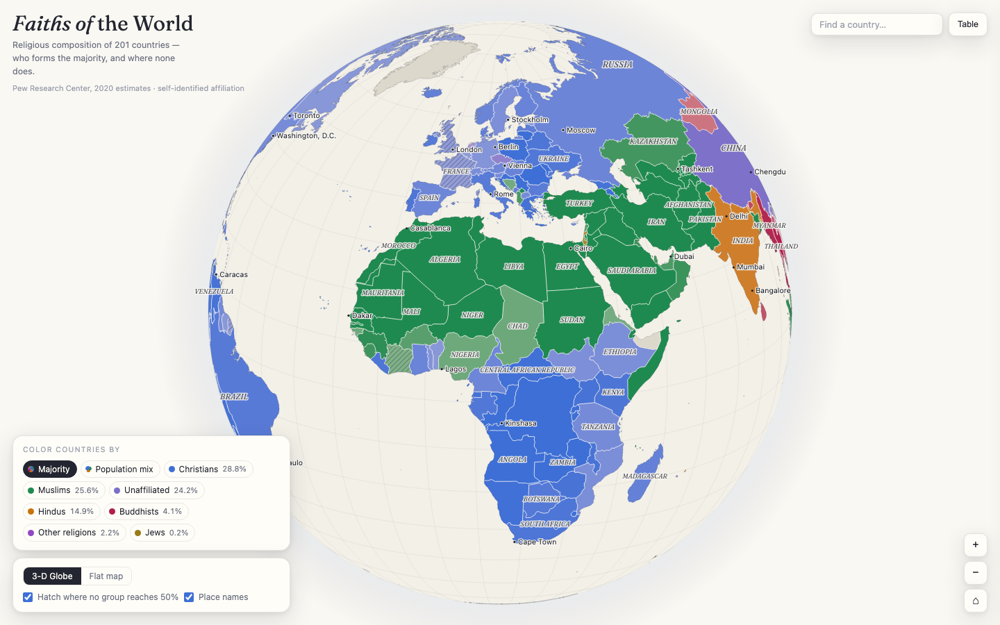

# 🌍 Faiths of the World

**Live: [faiths-of-the-world.vercel.app](https://faiths-of-the-world.vercel.app)**

An interactive 3-D globe and flat map of the religious composition of **201 countries**, built from Pew Research Center's 2020 estimates. Explore who forms the majority in each country, where no group holds a majority, and how minorities are distributed — down to a dot-density view where one dot represents one million people.



## Features

- **3-D globe** — drag to rotate, scroll or pinch to zoom (up to 16×), with a flat-map projection toggle
- **Majority view** — countries colored by their largest religious group; color depth encodes dominance, diagonal hatching marks countries where no group reaches 50%
- **Population mix view** — dot-density map: 1 dot ≈ 1 million people, colored by religion and mixed within each country, so majorities and minorities are visible together
- **Per-religion lens** — heat map of any single group's share (Christians, Muslims, unaffiliated, Hindus, Buddhists, other religions, Jews)
- **7,343 place names** — country labels plus cities and towns from Natural Earth, appearing progressively with zoom and never overlapping
- **Country detail panel** — full composition breakdown, population, majority/plurality badge, minority summary
- **Sortable data table** of all 201 countries
- **Search** that flies the globe to any country
- Light and dark theme, colorblind-validated palette, responsive down to phone screens

## Data & method

| Source | Used for |
|---|---|
| [Pew Research Center — Religious Composition by Country, 2010–2020](https://www.pewresearch.org/religion/feature/religious-composition-by-country-2010-2020/) (via [Our World in Data](https://ourworldindata.org/grapher/religious-composition)) | Religious shares per country, 2020 estimates |
| [Our World in Data — Population](https://ourworldindata.org/grapher/population) | 2020 population per country |
| [Natural Earth](https://www.naturalearthdata.com/) (via world-atlas) | Country boundaries (1:50m and 1:110m) and populated places |

Notes on the data:

- Estimates are based on **self-identified affiliation** from 2,700+ censuses and surveys, regardless of practice or belief.
- "Other religions" includes folk and traditional religions per Pew's 2025 category revision; China's high unaffiliated share (~90%) reflects that revision.
- Countries under 100,000 people are not covered by Pew and appear as "no data".
- In the population-mix view, dots are placed **randomly within each country** — data exists only at country level, so dot positions are not real settlement locations.

## Tech

Single self-contained HTML file (~1.6 MB, ~600 KB gzipped). No build step, no external requests at runtime.

- [D3.js](https://d3js.org/) v7 — orthographic & Natural Earth projections, zoom/drag behaviors
- [topojson-client](https://github.com/topojson/topojson-client) — geometry decoding
- Canvas 2D rendering with level-of-detail switching (light geometry while the view moves, full detail at rest) and a hidden color-picking canvas for precise hover hit-testing
- Embedded WOFF2 fonts (Fraunces), inline TopoJSON and data — works fully offline

## Run locally

```bash
python3 -m http.server 8000
# open http://localhost:8000
```

Or just open `index.html` in a browser.

## Deploy

```bash
vercel deploy --prod
```

## License

Code: MIT. Data: © Pew Research Center / Our World in Data (CC BY); boundaries and places: Natural Earth (public domain).
